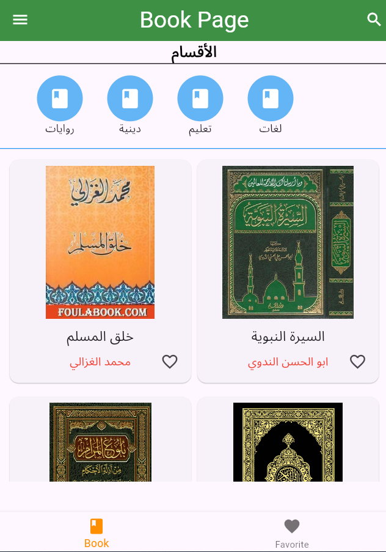
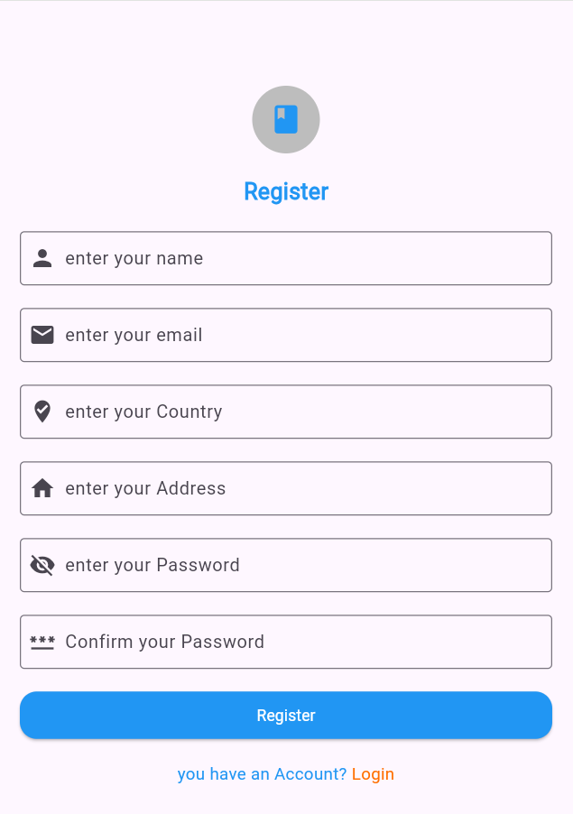
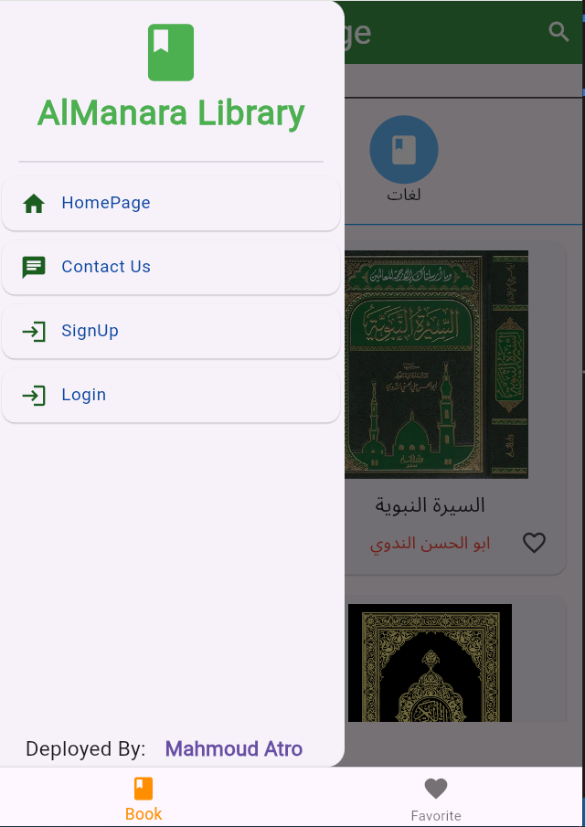
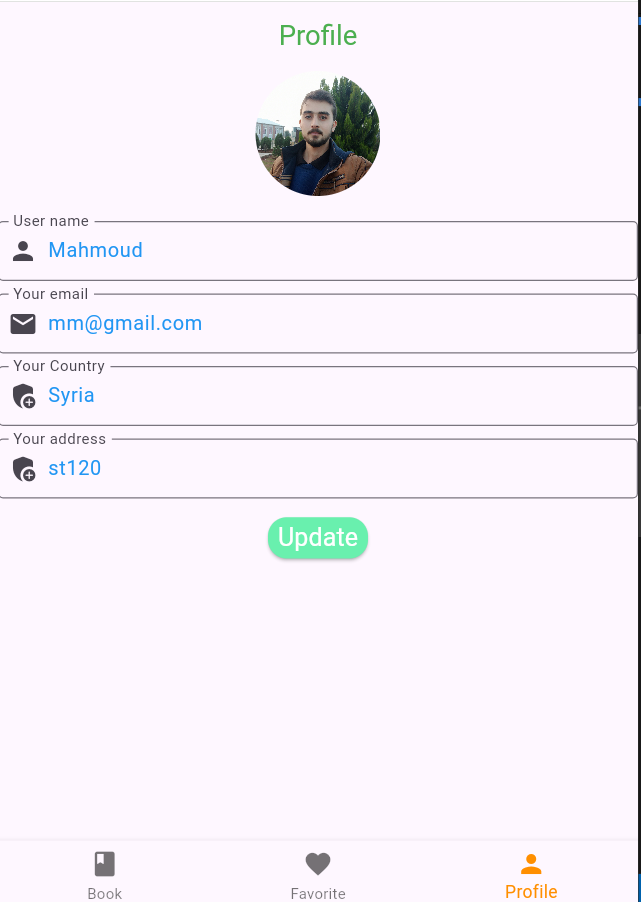
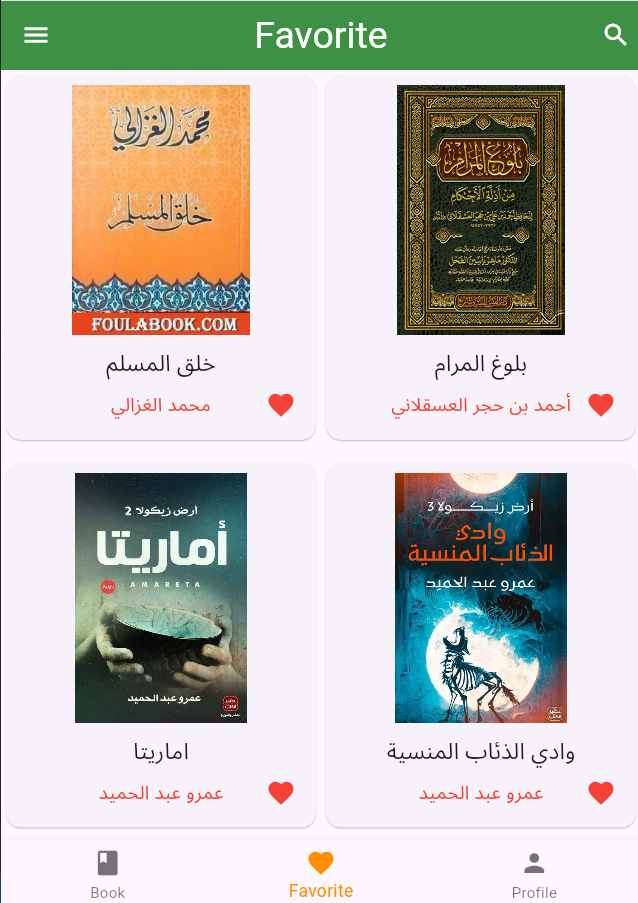
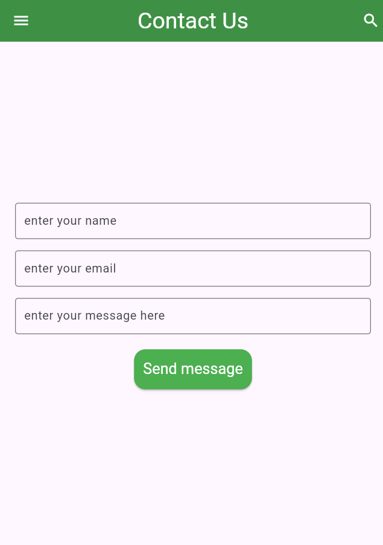
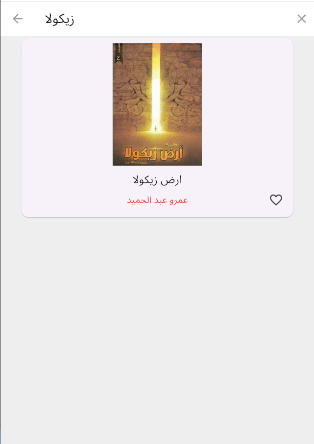

# mylibrary

A new Flutter project that using Laravel Backend and API methods.
mylibrary is application view a Books and can read and download or add to favorite . 
you can that login and register .
i am add contuct us page to send me any problem or commants .
created by : Eng.MahmoudAtro

# screenshots
page1;
login;
register;
page2;
profile;
favorite;
contactus;
search;
BookPage;

## Getting Started

This project is a starting point for a Flutter application.

A few resources to get you started if this is your first Flutter project:

- [Lab: Write your first Flutter app](https://docs.flutter.dev/get-started/codelab)
- [Cookbook: Useful Flutter samples](https://docs.flutter.dev/cookbook)

For help getting started with Flutter development, view the
[online documentation](https://docs.flutter.dev/), which offers tutorials,
samples, guidance on mobile development, and a full API reference.
